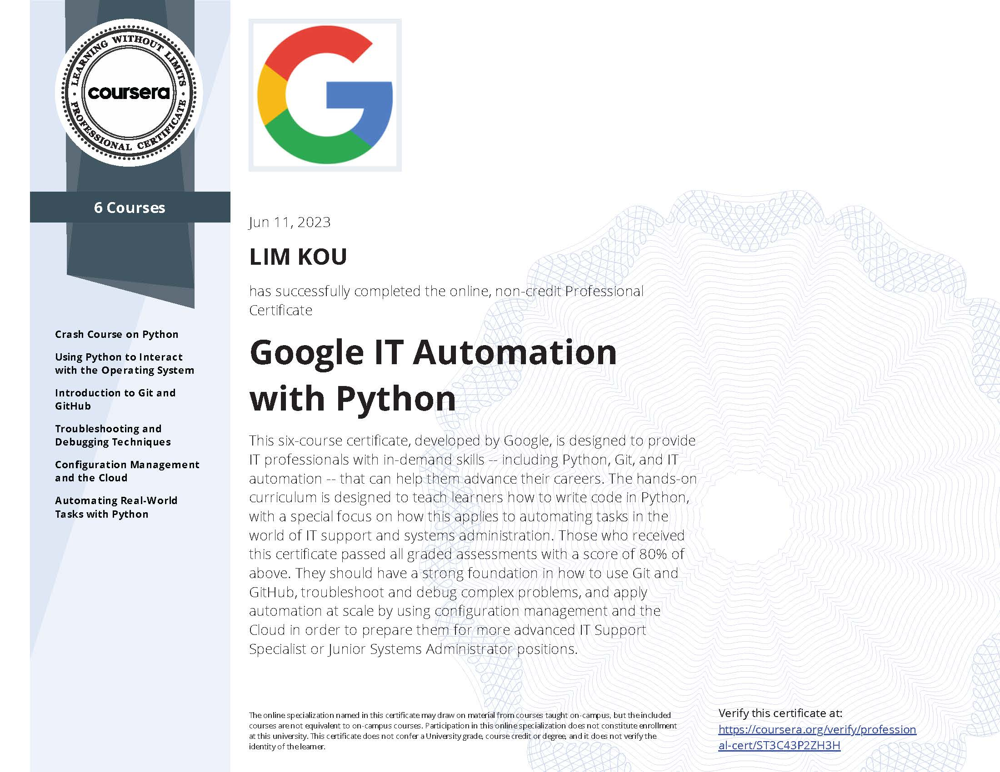

# Google IT Automation with Python

Knowing how to write code to solve problems and automate solutions is a crucial skill for anybody in IT. Python, in particular, is now the 
most in-demand programming language by employers
.

This program builds on your IT foundations to help you take your career to the next level. It’s designed to teach you how to program with Python and how to use Python to automate common system administration tasks. You'll also learn to use Git and GitHub, troubleshoot and debug complex problems, and apply automation at scale by using configuration management and the Cloud.

This certificate can be completed in about 6 months and is designed to prepare you for a variety of roles in IT, like more advanced IT Support Specialist or Junior Systems Administrator positions. Upon completion, you can share your information with potential employers, like Deloitte, Target, Verizon, and of course, Google. 

There are a total of six courses in this specialization:
* **[Crash Course on Python](https://github.com/Lim-Kou/Google-IT-Automation-with-Python-Public-Repo/tree/public/mod-1-Crash-Course-on-Python)**
* **[Using Python to Interact with the Operating System](https://github.com/Lim-Kou/Google-IT-Automation-with-Python-Public-Repo/tree/public/mod-2-Using-Python-to-Interact-with-the-Operating-System)**
* **[Introduction to Git and GitHub](https://github.com/Lim-Kou/Google-IT-Automation-with-Python-Public-Repo/tree/public/mod-3-Introduction-to-Git-and-GitHub)**
* **[Troubleshooting and Debugging Techniques](https://github.com/Lim-Kou/Google-IT-Automation-with-Python-Public-Repo/tree/public/mod-4-Troubleshooting-and-Debugging-Techniques)**
* **[Configuration Management and the Cloud](https://github.com/Lim-Kou/Google-IT-Automation-with-Python-Public-Repo/tree/public/mod-5-Configuration-Management-and-the-Cloud)**
* **[Automating Real-World Tasks with Python](https://github.com/Lim-Kou/Google-IT-Automation-with-Python-Public-Repo/tree/public/mod-6-Automating-Real-World-Tasks-with-Python)**

